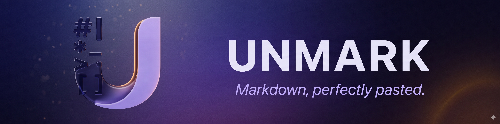

<div align="center">

<br>



<br><br>

A free macOS menu bar utility that turns raw Markdown into beautifully formatted text on your clipboard. Built for the AI chatbot era — paste from ChatGPT, Claude, or Gemini, copy formatted output into Mail, Pages, Notes, Slack, or anywhere else.

<br><br>

<a href="https://github.com/Premium-Cloud-LLC/unmark/releases/latest">
  
</a>

<br><br>

<a href="https://premium-cloud-llc.github.io/unmark/"></a>
<a href="docs/PRIVACY.md"></a>


<a href="https://github.com/Premium-Cloud-LLC/unmark/releases"></a>
<a href="https://github.com/Premium-Cloud-LLC/unmark/releases"></a>

</div>

<br>

---

<br>

## ⌘ &nbsp; The 5-second pitch

You're reading an AI response in ChatGPT. It's full of `**bold**`, `# headings`, `- bullets`. You select-all, copy, switch to Mail, paste — and get **literal asterisks and pound signs** in your email.

Unmark fixes that. Click the menu bar icon, paste the Markdown, switch to Mail, paste again. The formatting comes through.

<br>

```diff
- # Project status
- We **shipped** the new feature. Highlights:
- - Sub-100ms response time
- - Works in *every* major editor
+ Project status
+ We shipped the new feature. Highlights:
+ • Sub-100ms response time
+ • Works in every major editor
```

<sup><i>What you see on the left is what AI chatbots give you. What you see on the right is what your colleagues, family, and clients should see.</i></sup>

<br>

---

<br>

## ✦ &nbsp; The transformation, side-by-side

<table>
<tr>
<td width="50%" valign="top">

<sub><b>YOU PASTE</b></sub>

```markdown
# Heading
**bold text**
*italic*
`inline code`
- bullet item
> a quoted line
[a link](https://example.com)
```

</td>
<td width="50%" valign="top">

<sub><b>UNMARK COPIES</b></sub>

# Heading
**bold text**
*italic*
`inline code`
- bullet item
> a quoted line
[a link](https://example.com)

</td>
</tr>
</table>

<br>

---

<br>

## ✦ &nbsp; What makes it different

<table>
<tr>
<td width="33%" align="center" valign="top">

### ⚡

**Instant**

<sub>Sub-100ms conversion. The formatted text is on your clipboard before you can switch apps. 100ms paste-debounce, single-pass cmark parse.</sub>

</td>
<td width="33%" align="center" valign="top">

### 🔒

**100% Local**

<sub>No servers. No analytics. No accounts. The macOS App Sandbox blocks network access at the OS level — Unmark literally cannot phone home.</sub>

</td>
<td width="33%" align="center" valign="top">

### 📋

**Three Formats**

<sub>Rich Text for Mail and Pages. HTML for the web and Notion. Plain Text when you need formatting stripped clean. One click to switch.</sub>

</td>
</tr>
<tr>
<td width="33%" align="center" valign="top">

### 🪶

**Out of your way**

<sub>Lives in your menu bar. No Dock icon. No background daemon. ~2 MB on disk. Auto-clears 5 seconds after copy so it's ready for the next paste.</sub>

</td>
<td width="33%" align="center" valign="top">

### 🌗

**Light & dark aware**

<sub>The menu bar icon auto-tints for light or dark menu bars. The popover respects your system appearance. Brand identity, native feel.</sub>

</td>
<td width="33%" align="center" valign="top">

### 🤖

**Built for AI**

<sub>The way ChatGPT, Claude, and Gemini emit Markdown is exactly what Unmark consumes. Tables, code fences, nested lists — all handled.</sub>

</td>
</tr>
</table>

<br>

---

<br>

## ✦ &nbsp; The four-second workflow

<table>
<tr>
<td align="center" width="25%">

<h2>1</h2>
Click the **U** in your menu bar
<br><br>
<sub>Popover opens with a clean text editor</sub>

</td>
<td align="center" width="25%">

<h2>2</h2>
Paste Markdown<br>(`⌘V`)
<br><br>
<sub>Or type. Conversion happens as you go.</sub>

</td>
<td align="center" width="25%">

<h2>3</h2>
See `✓ Copied`
<br><br>
<sub>Amber checkmark animates in within 100ms</sub>

</td>
<td align="center" width="25%">

<h2>4</h2>
Switch + paste anywhere
<br><br>
<sub>Mail, Notes, Pages, Slack, Notion, anywhere</sub>

</td>
</tr>
</table>

<br>

---

<br>

## ✦ &nbsp; Get Unmark

### Easy way

<a href="https://github.com/Premium-Cloud-LLC/unmark/releases/latest">
  
</a>

Download the latest `.dmg`, drag Unmark to Applications, launch. The U appears in your menu bar.

> **System requirements:** macOS 13 Ventura or later · Apple Silicon and Intel both supported · ~2 MB.

### Homebrew

```bash
brew tap Premium-Cloud-LLC/unmark
brew install --cask unmark
```

### Build from source

```bash
git clone https://github.com/Premium-Cloud-LLC/unmark.git
cd unmark
brew install xcodegen
xcodegen generate
./run.sh
```

`./run.sh` builds, kills any old instance, and launches. The U appears in your menu bar within ~3 seconds.

<br>

---

<br>

## ✦ &nbsp; How it's built

<table>
<tr>
<th align="left">Layer</th>
<th align="left">Choice</th>
<th align="left">Why</th>
</tr>
<tr>
<td><b>UI framework</b></td>
<td>SwiftUI</td>
<td>Modern declarative; <code>MenuBarExtra(.window)</code> gives us a popover for free</td>
</tr>
<tr>
<td><b>Markdown engine</b></td>
<td><a href="https://github.com/johnxnguyen/Down">Down</a> (cmark)</td>
<td>Fastest pure-C Markdown parser; sub-millisecond on typical AI responses</td>
</tr>
<tr>
<td><b>Rich text rendering</b></td>
<td><code>DownStyler</code> → <code>NSAttributedString</code></td>
<td>Renders directly from the AST — no WebKit roundtrip, no main-thread block</td>
</tr>
<tr>
<td><b>Clipboard</b></td>
<td>AppKit <code>NSPasteboard</code></td>
<td>Writes RTF + HTML + plain text simultaneously so any destination app picks the best</td>
</tr>
<tr>
<td><b>Sandbox</b></td>
<td>Yes, full</td>
<td>Network entitlement explicitly omitted — cannot make outbound connections</td>
</tr>
<tr>
<td><b>Project generation</b></td>
<td><a href="https://github.com/yonaskolb/XcodeGen">xcodegen</a></td>
<td>Keeps <code>.xcodeproj</code> regenerable from <code>project.yml</code> — no merge conflicts</td>
</tr>
<tr>
<td><b>Distribution</b></td>
<td>Notarized DMG via <a href="https://github.com/create-dmg/create-dmg">create-dmg</a></td>
<td>Gatekeeper-clean install on any Mac, no warnings</td>
</tr>
</table>

<details>
<summary><b>Architecture in one paragraph</b></summary>

<br>

A SwiftUI `MenuBarExtra` scene shows a popover when you click the menu bar icon. The textarea pipes input through a 100ms debounce, then `Down`'s cmark parser builds an `NSAttributedString` via `DownStyler`. That attributed string is written to `NSPasteboard.general` in three formats (RTF, HTML, plain text) so any destination app gets the best representation. A 5-second visible countdown then clears the input, ready for the next paste. The brand identity (indigo `#7B5BD8`, amber `#FFB547`) lives in `BrandColors.swift` and is applied to the segmented format picker, the success checkmark, the auto-clear progress bar, and the focus ring. Total surface area: ~14 Swift files, ~700 lines.

</details>

<br>

---

<br>

## ✦ &nbsp; Privacy, in one sentence

Unmark cannot collect data because it has no network entitlement; the App Sandbox blocks outbound connections at the OS level.

<table>
<tr>
<td>

✗ &nbsp; No analytics SDKs
<br>
✗ &nbsp; No crash reporting services
<br>
✗ &nbsp; No accounts or sign-in
<br>
✗ &nbsp; No file system access outside the sandbox

</td>
<td>

✓ &nbsp; Apple Privacy Manifest declares "Data Not Collected"
<br>
✓ &nbsp; Network entitlement explicitly absent
<br>
✓ &nbsp; Open source — read every line
<br>
✓ &nbsp; Notarized by Apple's malware service

</td>
</tr>
</table>

<sub><a href="docs/PRIVACY.md">Read the full privacy policy →</a></sub>

<br>

---

<br>

## ✦ &nbsp; What's next

<details>
<summary><b>v1.1 — Quality of life</b></summary>

<br>

- Global keyboard shortcut (e.g. `⌃⌥⌘V`) to invoke the popover from anywhere
- [Sparkle](https://sparkle-project.org/) integration for one-click auto-updates
- "Launch at login" actually working in production builds (it requires Developer ID signing — hooked up but blocked by ad-hoc dev signing)

</details>

<details>
<summary><b>v1.2 — Power users</b></summary>

<br>

- Recent conversions history (last 5, stored locally only)
- Custom CSS for HTML output
- Tunable auto-clear timer
- Optional sound on copy

</details>

<details>
<summary><b>v1.3 — Reverse direction</b></summary>

<br>

- Rich Text → Markdown conversion (paste a formatted email, get clean Markdown)
- Drop a `.md` file to convert
- Quick Look extension for `.md` files

</details>

Have a request? **[Open an issue →](https://github.com/Premium-Cloud-LLC/unmark/issues)**

<br>

---

<br>

## ✦ &nbsp; Project layout

```
.
├── Sources/                  Swift source (~14 files)
│   ├── UnmarkApp.swift       Entry point + scenes
│   ├── ConverterView.swift   Main popover UI
│   ├── AboutView.swift       Branded About window
│   ├── HeaderView.swift      Branded header (U mark + UNMARK wordmark)
│   ├── EmptyStateView.swift  Showcase before/after
│   ├── FormatSelector.swift  Segmented picker w/ matchedGeometry
│   ├── CopyFeedbackView.swift Animated checkmark + amber pulse
│   ├── KeyboardHint.swift    ⌘ key pill component
│   ├── BrandColors.swift     Indigo / amber / ink palette
│   ├── BrandTypography.swift Avenir Next wordmark fonts
│   ├── MarkdownConverter.swift  Down → NSAttributedString
│   ├── ClipboardManager.swift   Multi-format clipboard writes
│   ├── OutputFormat.swift    Rich Text / HTML / Plain Text enum
│   └── LaunchAtLogin.swift   SMAppService wrapper
├── Resources/
│   ├── Assets.xcassets/      AppIcon (10 sizes) + MenuBarIcon (3 sizes)
│   ├── Info.plist            (auto-generated by xcodegen)
│   ├── Unmark.entitlements   App Sandbox enabled, NO network
│   └── PrivacyInfo.xcprivacy Apple privacy manifest
├── Logos/                    Brand asset masters (1024 / 2048)
├── docs/
│   ├── PRIVACY.md            Privacy policy
│   ├── APP_STORE_LISTING.md  App Store submission copy
│   ├── APP_STORE_AUDIT.md    Pre-flight rejection-risk audit
│   ├── SHIP_CHECKLIST.md     Day-by-day launch playbook
│   └── index.html            Marketing landing page (GitHub Pages)
├── scripts/
│   └── make-dmg.sh           Build → notarize → DMG pipeline
├── project.yml               xcodegen project spec
└── run.sh                    Local build + launch helper
```

<br>

---

<br>

## ✦ &nbsp; Acknowledgements

Built on the shoulders of:

- **[Down](https://github.com/johnxnguyen/Down)** — Markdown parsing (cmark)
- **[xcodegen](https://github.com/yonaskolb/XcodeGen)** — sane Xcode project generation
- **[create-dmg](https://github.com/create-dmg/create-dmg)** — DMG packaging
- **Apple's [HIG](https://developer.apple.com/design/human-interface-guidelines/)** — for setting the bar

<br>

---

<br>

<div align="center">

<sub>

**Made with ♥ for the Markdown era**
<br><br>
[Premium Cloud LLC](https://github.com/Premium-Cloud-LLC) &nbsp;·&nbsp; [Privacy](docs/PRIVACY.md) &nbsp;·&nbsp; [Source](https://github.com/Premium-Cloud-LLC/unmark) &nbsp;·&nbsp; [Issues](https://github.com/Premium-Cloud-LLC/unmark/issues)

</sub>

<br>

</div>
